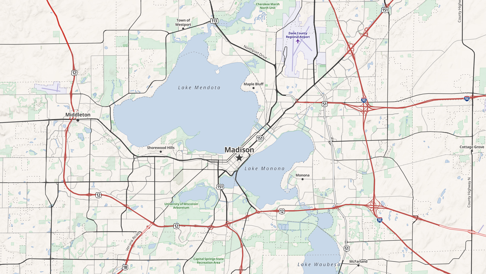

# Americanish

A recreation of the [OpenStreetMap Americana](https://americanamap.org/) style, using Sourdough tiles instead of [OpenMapTiles].



Road rendering uses [Roadzilla], customized to match Americana's colors and line widths. Highway shields are generated on-the-fly by Americana's [shieldlib], reusing the `shields.json`, sprite sheet, and fonts hosted at `americanamap.org`.

[OpenMapTiles]: https://openmaptiles.org/
[Roadzilla]: https://github.com/jake-low/roadzilla
[shieldlib]: https://github.com/osm-americana/openstreetmap-americana/tree/main/shieldlib

## Viewing

Because shields (and recolorable POI icons) are generated at runtime, this style needs a bit of JavaScript setup beyond a bare StyleJSON, which `viewer.html` provides:

```
node build.js americanish > dist/americanish.json
npx serve --cors -p 8000
open http://localhost:8000/americanish/viewer.html
```

You can also use `http://localhost:8000/americanish/compare.html` for a side-by-side comparison of Americana and Americanish.

## Limitations

Some design features of Americana are not currently possible to recreate using Sourdough tiles:

- OpenMapTiles merges concurrent route relations onto road segments (`route_1_name`, `route_1_ref`, `route_2_name`, etc). Sourdough's `routes` layer emits each route relation as its own MultiLineString feature. This means concurrent routes end up as coincident lines in the tiles. MapLibre's symbol placement avoids drawing overlapping shields, but placement is deterministic so perfectly coincident lines get all the same candidate placements. In these cases one of the two routes always "wins" every collision (the one with the lower `symbol-sort-key`, or the earlier one in the tile layer if no sort key is defined). The end result: for concurrent routes, you'll usually only see a shield for one of them.
- OpenMapTiles has `adm0_l` and `adm0_r` attributes on country borders to indicate the countries on each side of the line. Sourdough has no equivalent, so placing label text along the borders is not currently possible.
- OpenMapTiles has curved centerlines for lakes and other waterbodies, in order to allow placing text along them. Sourdough only has centroid points for labeling features, so lake labels don't follow the centerlines of the water area.
- Americana supports localizing map labels into the user's preferred language at runtime. It does this by using tiles which contain names in many languages (an extension of the official OpenMapTiles schema). Then, in the browser, it uses [diplomat] to modify the stylesheet to display names in the preferred language(s) where such names are available. In principle, the same thing is possible with Sourdough by generating a tileset using the `--language` and `--additional-languages` options ([see here](https://github.com/jake-low/sourdough/blob/main/USAGE.md#sourdough-specific-arguments)). However, the hosted tiles used for this example only include the default `name` attribute, so Americanish will display whatever name is in that tag in OSM, and does not support localization.

[diplomat]: https://github.com/osm-americana/diplomat

## License

This style borrows heavily from Americana's source code and visual design. Americana has been generously placed in the public domain by its authors. Americanish is likewise in the public domain; see the LICENSE file for details.

Note that this example loads shield definitions, fonts, and sprites directly from `americanamap.org`. If you build something real from this example, you should copy and host those assets yourself, rather than using the Americana project's servers and bandwidth.
